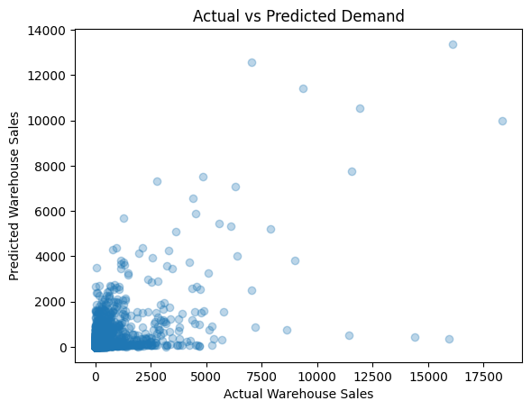

## Demand Prediction & Inventory Optimization (Applied ML)

Built an end-to-end machine learning pipeline to predict warehouse-level demand using retail sales data.

### Problem
Forecasting demand helps reduce overstocking and understocking and improves fulfillment planning.

### Approach
- Cleaned and preprocessed real-world sales data (~300K rows)
- Engineered temporal + product features
- Trained a Random Forest regression model
- Evaluated using MAE and RMSE
- Analyzed feature importance for business insights

### Results
- MAE ≈ 27 units
- Key predictors: Retail Sales, Retail Transfers, Item Type, Seasonality
- Retail sales and transfers emerged as strong leading indicators of warehouse demand, aligning with real-world inventory planning logic.

### Model Insights

**Actual vs Predicted Demand**

**Top Demand Drivers**

### Tech Stack
Python, Pandas, Scikit-learn, Random Forest, Matplotlib
